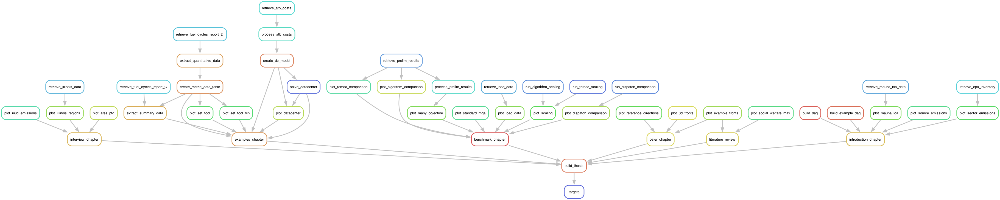

# 2025-dotson-dissertation

This repository holds my preliminary exam document. The style guide comes from the University of Illinois Urbana-Champaign Graduate College. A link to the resources may be found [here](https://grad.illinois.edu/thesis/format).

# Compiling the prelim document

## Windows
The document style must be compiled using `biber`. Doing this from the command line is more reliable than modifying TeXworks or other editor (I have experienced issues with Windows blocking a biber.exe call from TeXworks). **Make sure your LaTeX installation is up-to-date.**

```bash
C:\Users\samgd\Research\2025-dotson-dissertation\docs>pdflatex -shell-escape thesis.tex
C:\Users\samgd\Research\2025-dotson-dissertation\docs>biber thesis  # This is not a typo. Do not include a file extension.
C:\Users\samgd\Research\2025-dotson-dissertation\docs>pdflatex -shell-escape thesis.tex
C:\Users\samgd\Research\2025-dotson-dissertation\docs>pdflatex -shell-escape thesis.tex
```

## Linux

```bash
$ cd 2025-dotson-dissertation/docs
$ make
```

## From the template repository
### uiucthesis class

A LaTeX package for formatting theses in the format required by the University of Illinois at Urbana-Champaign.


# Reproducing the Analysis

Many of the plots that were present in the original preliminary document were produced using a `juptyer notebook`. The analyses new to this thesis were developed using a `snakemake` workflow. This repository includes an `environment.yaml` file to facilitate reproducibility of this work.

## Setting up the environment

To set up the `mamba` environment, run the following commands in either command prompt or terminal.

```bash
cd 2025-dotson-dissertation
mamba create
mamba activate 2025-dotson-thesis
```

## Running the workflow

The `snakemake` workflow used here is shown by the DAG below.



To run execute the `snakemake` workflow run the following commands in either command prompt or terminal.

```bash
cd analysis
snakemake --cores=1
```

#### Update Notes

- 3.1a (Samuel G Dotson)
  * Adds prelim macro
- 3.1 (Zachary J Weiner)
  * Format table of contents entries with titletoc, prepend "Chapter" and "Appendix"
  * Place appendices after references, returning to `\mainmatter` so that appendices are still numbered
  * Add copyright and licensing information
- 3.0 (Zachary J Weiner)
  * Significant revision, obsolete options removed and source simplified
- 2.25b (Stephen Mayhew)
  * Removed the Vita Section
  * Added a Makefile
  * Changed all dates from 2009 -> 2014
  * Be careful when updating the date in the first line of uiucthesis2021.dtx! All numbers must be two digits, including month and day.
